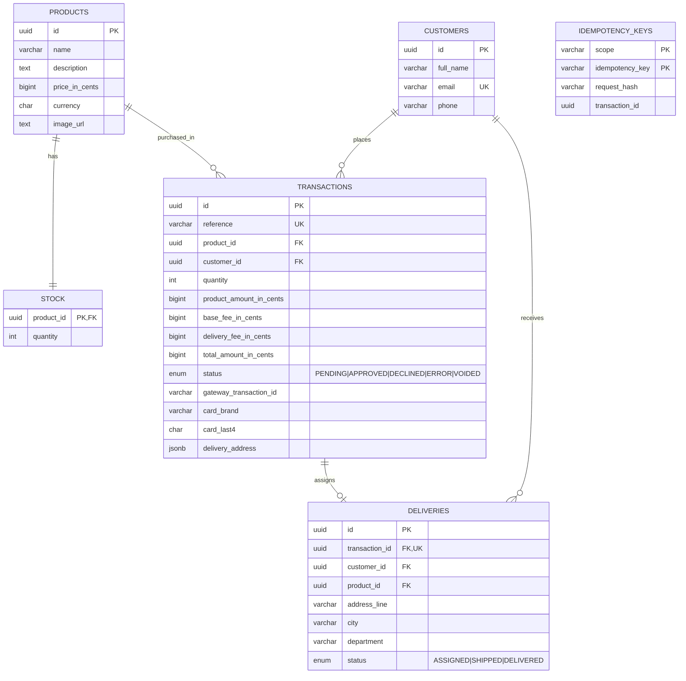

# Checkout Store — Backend API

NestJS + TypeScript API for the "Pay with credit card" onboarding flow:
products/stock, customers, transactions (create → charge → settle) and
deliveries, backed by PostgreSQL via TypeORM. Business logic is written as
framework-free use cases following **Hexagonal Architecture (Ports &
Adapters)** and **Railway-Oriented Programming (ROP)**.

Frontend lives in [`../frontend`](../frontend) — see that README for the UI
and the checkout flow it drives.

## Tech stack

| Concern            | Choice                                          |
|---------------------|--------------------------------------------------|
| Framework           | NestJS 12                                        |
| Language            | TypeScript                                       |
| Database            | PostgreSQL                                       |
| ORM                 | TypeORM (migrations, no `synchronize`)           |
| Validation          | `class-validator` / `class-transformer`          |
| Security headers    | `helmet`                                         |
| API docs            | `@nestjs/swagger` (OpenAPI, served at `/docs`)   |
| Payment gateway     | Third-party sandbox gateway, called over HTTP    |
| Testing             | Jest (unit, integration, e2e)                    |

## API documentation (Postman / Swagger)

The API is self-documenting via OpenAPI:

- **Swagger UI:** start the server and open `http://localhost:3000/docs`
  (replace the host with the deployed URL once published).
- **Raw OpenAPI JSON** (importable straight into Postman/Insomnia as a
  collection): `http://localhost:3000/docs-json`.

To import into Postman: *File → Import → Link*, paste the `/docs-json` URL
(or download it and import the file) — Postman generates a full collection
with every endpoint, request body and response schema from it.

### Endpoints

| Method | Path                                       | Purpose                                                                 |
|--------|---------------------------------------------|--------------------------------------------------------------------------|
| GET    | `/products`                                 | List products with available stock, description and price               |
| GET    | `/products/:id`                             | Get a single product with available stock                                |
| GET    | `/stock`                                    | List stock levels for every product                                      |
| GET    | `/stock/:productId`                         | Get available stock for one product                                      |
| POST   | `/customers`                                | Create or update (upsert by email) a customer                            |
| GET    | `/checkout/config`                          | Store fees (base/delivery) and the gateway's public key + acceptance token |
| POST   | `/transactions`                             | Create a `PENDING` transaction for a purchase (requires `Idempotency-Key` header) |
| POST   | `/transactions/:id/payment`                 | Charge a `PENDING` transaction through the gateway                       |
| GET    | `/transactions/:id`                         | Get a transaction; reconciles with the gateway if still pending          |
| GET    | `/transactions/:transactionId/delivery`     | Get the delivery assigned once a transaction is approved                 |

Every write endpoint validates its body with `class-validator`
(`whitelist: true, forbidNonWhitelisted: true`), so unexpected or malformed
fields are rejected before reaching a use case.

## Architecture: Hexagonal + Ports & Adapters

Each business area (`products`, `stock`, `customers`, `transactions`,
`deliveries`) is a self-contained module with the same three layers:

```
<module>/
├── domain/            # Entities, value types, and *ports* (interfaces) —
│                       #   zero framework or ORM imports
│   └── ports/          #   e.g. TransactionRepositoryPort, PaymentGatewayPort
├── application/        # Use cases: orchestrate ports, contain the business
│                       #   rules, return a Result (never throw for expected
│                       #   failures)
├── infrastructure/
│   ├── http/            # Controllers + DTOs — the "driving" adapters
│   └── persistence/     # TypeORM entities + repositories implementing the
│                        #   domain ports — the "driven" adapters
```

Controllers depend only on use cases; use cases depend only on port
*interfaces*, injected via NestJS DI tokens (`src/shared/tokens.ts`).
Swapping Postgres/TypeORM for another store, or the payment gateway HTTP adapter for a
different gateway, means writing a new adapter — no use case changes.

## Railway-Oriented Programming (ROP)

Expected failures (not found, out of stock, gateway declined, etc.) are
modeled as data, not exceptions, using a small `Result<T, E>` type
(`src/shared/rop/result.ts`) and a `Flow` builder for chaining steps
(`src/shared/rop/flow.ts`):

```ts
type Result<T, E> = { ok: true; value: T } | { ok: false; error: E };
```

A use case reads as a pipeline — each step only runs if the previous one
succeeded, and the first failure short-circuits the rest:

```ts
Flow.of(loadTransaction(id))
  .andThen(assertPending)
  .andThen(chargeWithGateway)
  .andThen(persistSettlement)
  .done(); // Promise<Result<Transaction, ProcessPaymentError>>
```

`unwrapOrThrow` (`src/shared/http/result-to-http.ts`) converts an `Err` into
the right HTTP status only at the controller boundary — the domain and
application layers never throw for expected business failures, only for
truly exceptional/programmer errors, which `GlobalExceptionFilter` catches
as a last resort.

## Data model



Notable design choices, straight from the migration
(`src/database/migrations/1790374955782-InitialSchema.ts`):

- **`stock` is its own table**, not a column on `products` — so stock
  decrements are their own concern/lock boundary and don't touch the
  product's own row.
- **Money is stored in cents** (`bigint`) everywhere, never floats.
- **`total_amount_in_cents` is recomputed server-side** from the product
  price, base fee and delivery fee at transaction-creation time
  (`fee-calculator.ts`) — the client only ever *displays* a quote, never
  sets the amount charged.
- **No raw card data is persisted** — only `card_brand` and `card_last4`
  for display; the card token comes from the payment gateway and is used once.
- **`idempotency_keys`** ties a client-supplied `Idempotency-Key` header to
  the transaction it created, so a retried `POST /transactions` (e.g. a
  flaky connection) returns the original transaction instead of creating a
  duplicate.

## Getting started

Requires a running PostgreSQL instance. The easiest way to get one is the
`docker-compose.yml` at the repo root:

```bash
docker compose up -d postgres   # from the repo root
```

Then, from this directory:

```bash
npm install
cp .env.example .env          # already points at the compose Postgres above
npm run migration:run         # creates all tables
npm run seed                  # seeds 5 dummy products with stock
npm run start:dev             # http://localhost:3000, docs at /docs
```

See the root [README.md](../README.md#quick-start) for running the backend
itself in Docker too, instead of on the host.

### Environment variables

See [`.env.example`](./.env.example).

| Variable                    | Purpose                                                                     |
|-----------------------------|-----------------------------------------------------------------------------|
| `DATABASE_URL`              | Postgres connection string                                                  |
| `NODE_ENV`                  | `development` enables SQL query logging                                     |
| `PORT`                      | HTTP port (default `3000`)                                                  |
| `CORS_ORIGIN`               | Comma-separated list of allowed origins for the frontend                    |
| `GATEWAY_BASE_URL`          | Payment gateway API base URL (sandbox or production)                        |
| `GATEWAY_PUBLIC_KEY`        | Payment gateway public key, returned to the frontend via `/checkout/config` |
| `GATEWAY_PRIVATE_KEY`       | Payment gateway private key, used server-side to create/charge transactions |
| `GATEWAY_EVENTS_SECRET`     | Verifies the gateway's webhook event signatures, if/when enabled            |
| `GATEWAY_INTEGRITY_SECRET`  | Used to sign the integrity hash the gateway requires per transaction        |
| `BASE_FEE_IN_CENTS`         | Store's fixed base fee, added to every order                                |
| `DELIVERY_FEE_IN_CENTS`     | Store's fixed delivery fee, added to every order                            |

Startup fails fast with a clear error if any required variable is missing or
invalid (`src/shared/config/env.validation.ts`).

## Scripts

| Command                     | Does                                                       |
|-------------------------------|---------------------------------------------------------------|
| `npm run start:dev`          | Start with hot reload                                       |
| `npm run build`               | Compile to `dist/`                                          |
| `npm run start:prod`          | Run the compiled build                                      |
| `npm run migration:run`       | Apply pending TypeORM migrations                             |
| `npm run migration:generate`  | Generate a new migration from entity changes                 |
| `npm run seed`                | Seed the 5 dummy products + stock                             |
| `npm test`                    | Unit tests                                                   |
| `npm run test:cov`            | Unit tests with coverage report                               |
| `npm run test:integration`    | Integration tests against a real Postgres (needs `DATABASE_URL`) |
| `npm run test:e2e`            | End-to-end tests against a running app instance               |
| `npm run lint`                | Lint with oxlint                                             |

## Testing & coverage

Every use case, controller, repository adapter and shared helper (ROP
`Result`/`Flow`, fee calculator, error mapper) has unit tests, isolated from
Postgres and the payment gateway with fakes/mocks (`src/transactions/application/testing/fake-payment-gateway.ts`,
`src/shared/testing/result-helpers.ts`). Integration tests
(`test/*.integration-spec.ts`, if present) exercise the TypeORM repositories
against a real database; e2e tests (`test/*.e2e-spec.ts`) drive the full
HTTP surface of the running app.

Latest local run (`npm run test:cov`):

| Metric     | Coverage |
| ---------- | -------- |
| Statements | 100%     |
| Branches   | 98.73%   |
| Functions  | 98.34%   |
| Lines      | 100%     |

18 suites / 92 tests, all passing. The backend coverage is above the 80% bar
required by the test brief.

The remaining uncovered branches are limited to two branches in
`transactions/application/process-payment.use-case.ts` and one branch in
`transactions/infrastructure/persistence/typeorm-settlement.repository.ts`.
Re-run `npm run test:cov` to regenerate the coverage report if the code changes.

## Security

- `helmet()` sets standard security headers on every response.
- All request bodies are validated and stripped of unknown fields
  (`ValidationPipe({ whitelist: true, forbidNonWhitelisted: true })`).
- CORS is restricted to `CORS_ORIGIN`, not left open by default in
  production.
- Card numbers/CVC never reach this API — only a single-use token from the
  payment gateway, plus non-sensitive brand/last-4 digits are stored.
- `GlobalExceptionFilter` ensures unexpected errors return a generic message
  instead of leaking stack traces or internals.

## Deployment

A production `Dockerfile` (multi-stage build) is included. Point it at a
managed Postgres instance (e.g. AWS RDS) and run behind HTTPS (e.g.
CloudFront/ALB with a TLS certificate) — see the root [`README.md`](../README.md)
for the deployed URL once published.